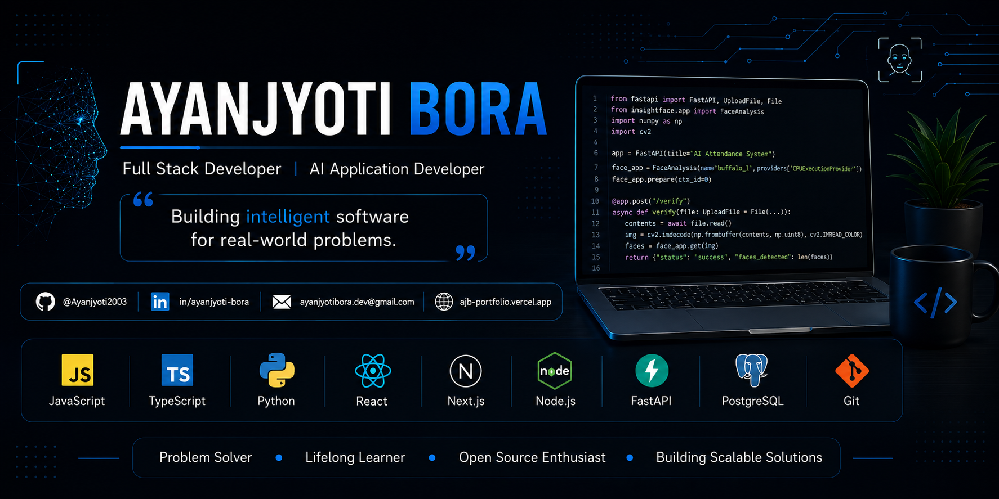

# <!-- GitHub Profile README -->

  

<h1 align="center">Ayanjyoti Bora</h1>

<h3 align="center">Full Stack Developer • AI Application Developer</h3>

<i>Building intelligent software for real-world problems.</i>

---

# 💫 About Me

I'm a Full Stack Developer passionate about building AI-powered web and mobile applications that solve real-world problems.

I enjoy developing responsive frontends with **React.js** and **Next.js**, scalable backends using **Node.js**, **Express.js** and **FastAPI**, and integrating AI into practical software products.

- 🎓 B.Tech in Computer Science & Engineering (2022–2026)
- 🏆 IBM National Hackathon 2025 Finalist
- 💼 Full Stack Development Intern
- 🤖 AI Application Developer
- 🌱 Currently learning Machine Learning & Scalable Backend Systems

---

# 🚀 Current Focus

- Intelligent Office Access System
- Job Shield
- AI-powered mobile applications
- Backend architecture
- Computer Vision

---

# 💡 Areas of Interest

- Artificial Intelligence
- Computer Vision
- Full Stack Development
- Scalable Backend Systems
- Cloud Deployment
- Developer Experience

---

# 🛠 Tech Arsenal

## Languages

## Frontend

## Mobile

## Backend

## Databases

## Tools

**Also experienced with:** Render • Expo • REST APIs • Firebase Authentication

---

# 🚀 Featured Work

## 🤖 Intelligent Office Access System
AI-powered employee recognition and attendance platform featuring face recognition, pose estimation, tailgating detection, real-time attendance, admin dashboard and offline-first architecture.

**Stack:** React • FastAPI • Python • Supabase • Computer Vision

> 🔗 Repository: *Add Link*

---

## 🛡 Job Shield
AI-powered job analysis platform for resume evaluation, scam detection, job matching and community reporting.

**Stack:** Next.js • TypeScript • Tailwind CSS

> 🔗 Repository: *Add Link*

---

## 🏋 Gym Tracker
Cross-platform AI fitness application with workout tracking, AI coach, Firebase authentication, cloud sync and offline mode.

**Stack:** React Native (Expo) • Firebase

> 🔗 Repository: *Add Link*

---

## 🛒 MiniShop
Modern full-stack e-commerce application with authentication, shopping cart, product filtering and REST APIs.

**Stack:** React • Node.js • MongoDB • Firebase

> 🔗 Repository: *Add Link*

---

# 🏆 Experience & Achievements

## IBM National Hackathon 2025
- Finalist
- Led a 4-member team
- Built an AI-powered employee recognition and attendance system.

## Full Stack Web Development Intern
- Developed and deployed full-stack applications.
- Integrated authentication and REST APIs.
- Worked with Git, GitHub, Vercel and Render.

---

# 📜 Certifications

- IBM Generative AI for Software Developers
- IBM Artificial Intelligence Fundamentals
- MongoDB Basics
- SQL to MongoDB
- Angular
- JavaScript Development

---

# 📊 GitHub Analytics

---

# 🌐 Connect With Me

- 🌍 Portfolio: https://ajb-portfolio.vercel.app
- 💼 LinkedIn: https://www.linkedin.com/in/ayanjyoti-bora
- 📧 Email: ayanjyotibora8@gmail.com
- 💻 GitHub: https://github.com/Ayanjyoti2003

---

# 📌 Repository Roadmap

Pin these repositories:

1. Intelligent Office Access System
2. Job Shield
3. Gym Tracker
4. Portfolio
5. MiniShop
6. Best future project / Open Source

---

<b>Code. Learn. Build. Repeat.</b> 
Thanks for visiting my profile!

