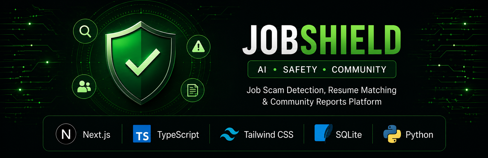
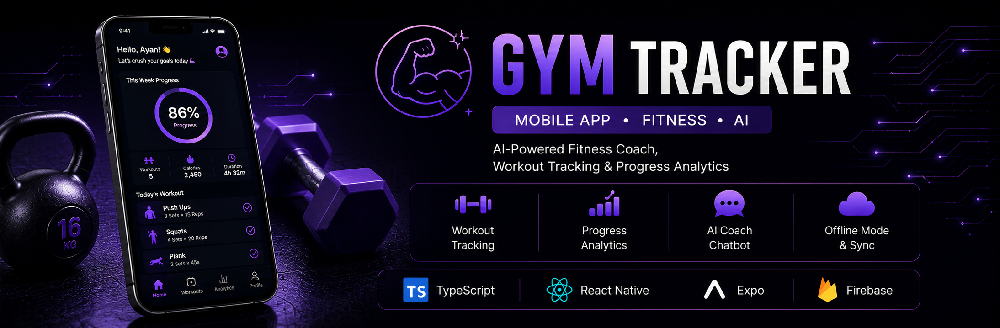
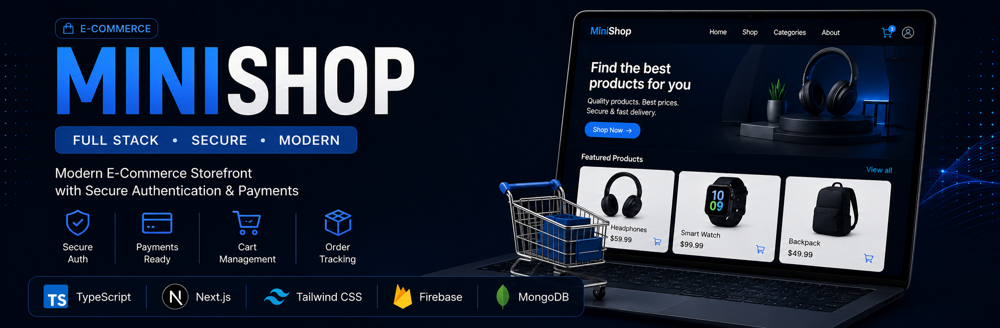

# <!-- GitHub Profile README -->

  

<h1 align="center">Ayanjyoti Bora</h1>

<h3 align="center">Full Stack Developer • AI Application Developer</h3>

<i>Building intelligent software for real-world problems.</i>

<h2 align="center">About Me</h2>

I'm a Full Stack Developer passionate about building AI-powered web and mobile applications that solve real-world problems.

I enjoy developing responsive frontends with **React.js** and **Next.js**, scalable backends using **Node.js**, **Express.js** and **FastAPI**, and integrating AI into practical software products.

- B.Tech in Computer Science & Engineering (2022–2026)
- IBM National Hackathon 2025 Finalist
- Full Stack Development Intern
- Passionate about AI-powered applications
- Currently exploring Machine Learning & Scalable Backend Systems

<h2 align="center">Current Focus</h2>

- Intelligent Office Access System
- Job Shield
- AI-powered mobile applications
- Backend architecture
- Computer Vision

<h2 align="center">Tech Stack</h2>

<h3>Languages</h3>

<h3>Frontend</h3>

<h3>Mobile</h3>

  
  

<h3>Backend</h3>

<h3>Databases</h3>

<h3>Tools</h3>

**Also experienced with:** Render • Expo • REST APIs • Firebase Authentication

<h2 align="center">Featured Projects</h2>

  A selection of projects showcasing my experience in AI, full-stack development, and cross-platform applications.

 

  

### AI Attendance System

AI-powered employee recognition and attendance platform featuring face recognition, pose estimation, tailgating detection, real-time attendance, an admin dashboard, and an offline-first architecture.

**Tech Stack**

`React` • `FastAPI` • `Python` • `Postgresql` • `Computer Vision` • `Typescript` • `Javascript`

  

---

  

### Job Shield

AI-powered job analysis platform for resume evaluation, scam detection, job matching and community reporting.

**Tech Stack** 

`Next.js` • `TypeScript` • `Tailwind CSS` • `SQLite` • `Python`

  
  

---

  

### Gym Tracker

Cross-platform AI fitness application with workout tracking, AI coach, Firebase authentication, cloud sync and offline mode.

**Tech Stack**

`React Native` • `Expo` • `Firebase` • `Typescript`

  
  

---

  

### MiniShop

Modern full-stack e-commerce application with authentication, shopping cart, product filtering and REST APIs.

**Tech Stack** 

`Typescript` • `Next.js` • `MongoDB` • `Firebase` • `Tailwind CSS`

  
  

<h2 align="center">Experience</h2>

<h3>IBM National Hackathon 2025</h3>
- Finalist
- Led a 4-member team
- Built an AI-powered employee recognition and attendance system.

<h3>Full Stack Web Development Intern</h3>
- Developed and deployed full-stack applications.
- Integrated authentication and REST APIs.
- Worked with Git, GitHub, Vercel and Render.

<h2 align="center">Certifications</h2>

- IBM Generative AI for Software Developers
- IBM Artificial Intelligence Fundamentals
- MongoDB Basics
- SQL to MongoDB
- Angular
- JavaScript Development

<h2 align="center">Development Dashboard</h2>

<table align="center">
    <tr>
        <td>
        
        </td>
        <td>
        
        </td>
    </tr>
</table>

  

<h2 align="center">Contribution Activity</h2>

  

<h2 align="center">Connect With Me</h2>

<table align="center">
  <tr>
    <td></td>
    <td></td>
    <td></td>
    <td></td>
  </tr>
</table>

  <i>Building intelligent software that solves real-world problems.</i>

